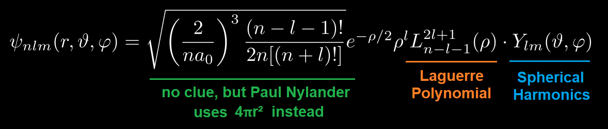
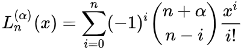
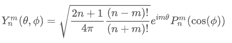
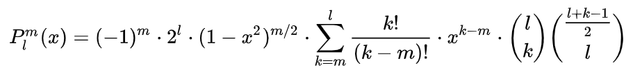
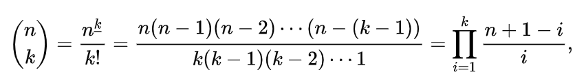
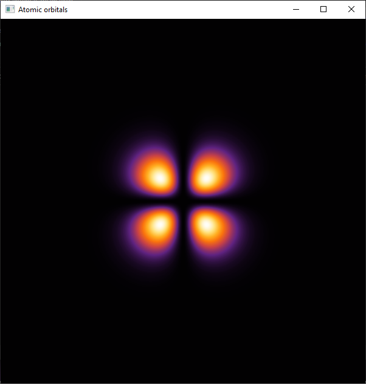
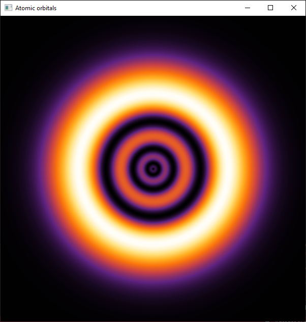
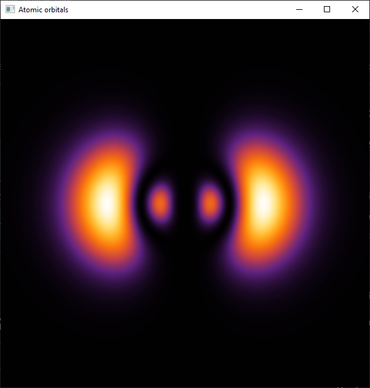

# Dibujando orbitales atómicos del hidrógeno con SFML
## TODO
- Usar OpenMP para aumentar la velocidad de renderizado
- Implementar un degradado mejor que no dependa de una imagen :p

La idea es usar la función de onda del hidrógeno para calcular la probabilidad p de encontrar el electrón en una determinada posición. Como se muestra en la siguiente imagen:

Cuanto más grande sea p para un cierto pixel (posición), su color va estar más a la derecha del degradado que se muestra.
Para calcular el valor de la función de onda, hay que diseccionarla un poco: 

- El primer término se puede aproximar por 4πr^2.
- Los polinomios de Laguerre se pueden calcular con: 

- Los armónicos esféricos se pueden calcular con: 

 
Donde el último término hace referencia a los polinomios asociados de Legendre, los cuales salen al vuelo con:
 

Donde el coeficiente binomial al final en realidad son la generalización, que se calcula con:
 

El armónico esférico es una función que devuelve un número complejo, pero en realidad solo importa su módulo.

El cálculo de la probabilidad es algo complejo, se puede ver mejor en el código.

Para dar color a los pixeles se tuvo que tomar una porción del gradiente de la primera imagen y obtener todos los colores a partir del pixel en la columna 0 hasta la última columna, con lo que se tienen 911 colores, si tomamos la siguiente imagen:

Después asociar cada propabilidad p a un color.

# Resultados
### (3, 2, 1)

### (4, 0, 0)

### (4, 2, 2)

